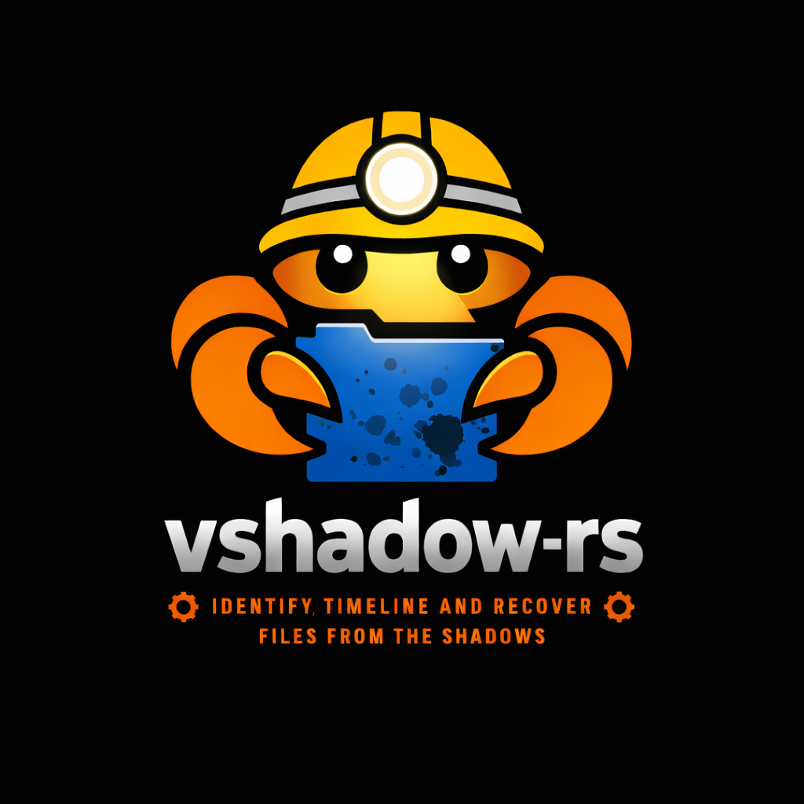
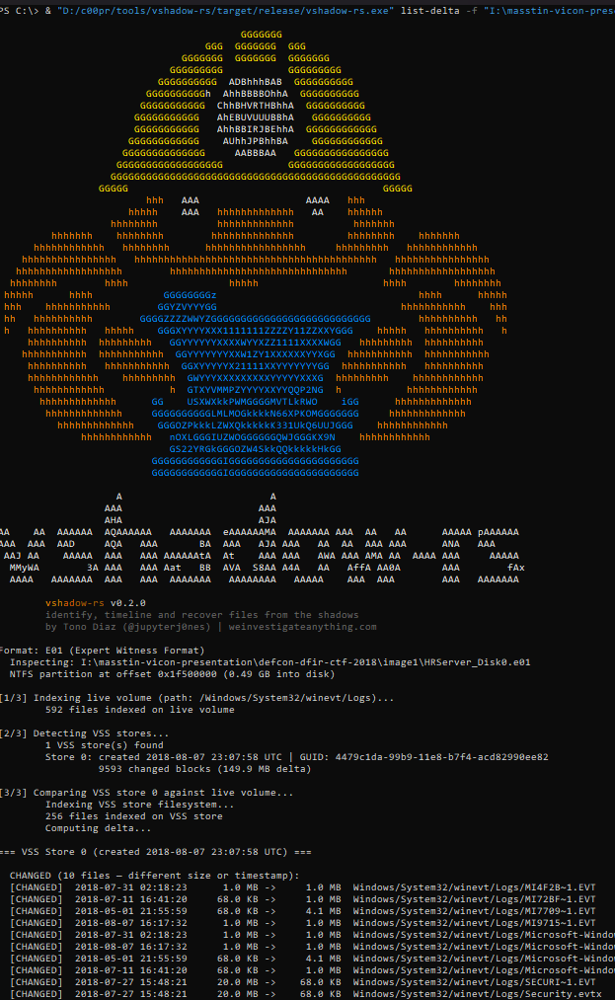

# vshadow-rs

<div align="center">
  
  <br><br>
  <strong>Pure Rust parser for Windows Volume Shadow Copy (VSS) snapshots</strong>
  <br><br>

  [](https://crates.io/crates/vshadow)
  [](https://www.gnu.org/licenses/agpl-3.0)
  [](https://www.rust-lang.org/)
  []()

</div>

---

Identify, timeline and recover files from the shadows. **No Windows APIs. No FUSE. No C dependencies. Cross-platform.**

> Part of the [We Investigate Anything](https://weinvestigateanything.com) project.
> Full documentation: [vshadow-rs article](https://weinvestigateanything.com/en/tools/vshadow-rs/) |
> Used by [masstin](https://github.com/jupyterj0nes/masstin) for forensic image analysis.

---

## Why?

Attackers clear Windows event logs. Volume Shadow Copies preserve the old data. But accessing it is painful:

| Tool | Problem |
|------|---------|
| **vshadowmount** | Requires FUSE, Linux only, can't read E01 |
| **EVTXECmd --vss** | Requires Windows VSS COM API, live systems only |

**vshadow-rs** reads the on-disk VSS format directly from any forensic image. One binary, any platform. And unlike any other tool, it can **compare snapshots against the live volume** to show you exactly what changed — the delta that tells the story.

---

## Install

### Download pre-built binary (recommended)

> **No Rust toolchain needed.** Just download and run.

| Platform | Download |
|----------|----------|
| Windows | [`vshadow-rs-windows.exe`](https://github.com/jupyterj0nes/vshadow-rs/releases/latest) |
| Linux | [`vshadow-rs-linux`](https://github.com/jupyterj0nes/vshadow-rs/releases/latest) |
| macOS | [`vshadow-rs-macos`](https://github.com/jupyterj0nes/vshadow-rs/releases/latest) |

Go to [**Releases**](https://github.com/jupyterj0nes/vshadow-rs/releases) and download the binary for your platform. That's it.

### Build from source (alternative)

```bash
cargo install vshadow
```

---

## CLI Commands

### `info` — Detect VSS stores

```bash
vshadow-rs info -f evidence.E01
vshadow-rs info -f disk.dd --offset 0x26700000
```

Auto-detects NTFS partitions (GPT + MBR), checks each one for VSS, reports store count, creation date, and how much data changed since the snapshot.

### `list` — Browse files

```bash
# Live volume
vshadow-rs list -f evidence.E01 --live -p "Windows/System32/winevt/Logs"

# VSS store (the snapshot — see what was there BEFORE the attacker cleared logs)
vshadow-rs list -f evidence.E01 -s 0 -p "Windows/System32/winevt/Logs"
```

### `list-delta` — Find what changed between VSS and live volume

This is what makes vshadow-rs unique. It compares the snapshot filesystem against the live volume and shows you only the files that were **deleted** or **changed** — the forensic gold.

```bash
# Show delta for all VSS stores
vshadow-rs list-delta -f evidence.E01

# Focus on event logs only
vshadow-rs list-delta -f evidence.E01 -p "Windows/System32/winevt/Logs"

# Export delta to CSV
vshadow-rs list-delta -f evidence.E01 -o delta.csv
```



The output shows each changed file with its size on the live volume vs. the VSS store, making it immediately obvious when logs have been cleared (68 KB in VSS → 1 MB on live, or missing entirely).

### `extract` — Recover files

```bash
# Recover event logs from VSS (deleted from live but preserved in snapshot)
vshadow-rs extract -f evidence.E01 -s 0 -p "Windows/System32/winevt/Logs" -o ./recovered/

# Extract from live volume for comparison
vshadow-rs extract -f evidence.E01 --live -p "Windows/System32/winevt/Logs" -o ./live/
```

### `timeline` — Generate MACB timeline from VSS stores

Generates a full MACB (Modified, Accessed, Changed, Born) timeline CSV from the delta — only files that exist in VSS but not on the live volume, or that changed. Two output formats:

```bash
# Expanded format: 8 rows per file (SI + FN timestamps)
vshadow-rs timeline -f evidence.E01 -o timeline.csv

# MACB format: 1 row per file with MACB flags
vshadow-rs timeline -f evidence.E01 --format macb -o timeline.csv

# Include live volume in the timeline
vshadow-rs timeline -f evidence.E01 --include-live -o timeline.csv
```

This lets you build a timeline of what the attacker deleted or modified, with full NTFS timestamp precision.

---

## What makes vshadow-rs unique

1. **Delta detection** (`list-delta`): no other tool compares VSS snapshots against the live volume to show exactly what changed. This is the fastest way to find cleared logs, deleted files, and tampered evidence.

2. **MACB timelines from shadows** (`timeline`): generate forensic timelines from the delta — only the relevant changes, not the entire filesystem. Feed directly into timeline analysis tools.

3. **Direct E01 support**: read forensic images without mounting, converting, or extracting. One step from E01 to results.

4. **Pure Rust, cross-platform**: no FUSE, no Windows APIs, no C libraries. Works on the analyst's machine regardless of OS.

5. **Library + CLI**: use the `vshadow` crate in your own Rust tools, or use the `vshadow-rs` binary from the command line.

---

## Comparison

| Feature | libvshadow (C) | vshadowmount | vshadowinfo | **vshadow-rs** |
|---------|:---:|:---:|:---:|:---:|
| Language | C | C (libvshadow) | C (libvshadow) | **Rust** |
| List VSS stores | Yes | - | Yes | **Yes** |
| Show creation dates | Yes | - | Yes | **Yes** |
| Show delta size (changed blocks) | - | - | - | **Yes** |
| Mount as FUSE filesystem | - | Yes | - | - |
| **List files inside VSS** | - | via mount | - | **Yes** |
| **Extract files from VSS** | - | via mount | - | **Yes** |
| **Compare VSS vs live (delta)** | - | - | - | **Yes** |
| **MACB timeline from delta** | - | - | - | **Yes** |
| **Browse live volume** | - | - | - | **Yes** |
| **Read E01 directly** | - | - | - | **Yes** |
| **Auto-detect GPT/MBR** | - | - | - | **Yes** |
| No C dependencies | - | - | - | **Yes** |
| No FUSE required | Yes | - | Yes | **Yes** |
| Cross-platform | Linux/Mac | Linux | Linux/Mac/Win | **All** |

> **libvshadow** is the reference C library by Joachim Metz. vshadowmount and vshadowinfo are its CLI tools. vshadow-rs is a completely independent implementation in Rust — it does not use libvshadow.

---

## Forensic Workflow

```bash
# 1. Inspect image for shadow copies
vshadow-rs info -f suspect.E01

# 2. Find what changed between VSS and live volume
vshadow-rs list-delta -f suspect.E01 -p "Windows/System32/winevt/Logs"

# 3. Recover the pre-deletion event logs
vshadow-rs extract -f suspect.E01 -s 0 -p "Windows/System32/winevt/Logs" -o ./recovered/

# 4. Generate a timeline of deleted/modified files
vshadow-rs timeline -f suspect.E01 -o timeline.csv

# 5. Parse recovered logs with masstin
masstin -a parse-windows -d ./recovered/ -o lateral.csv
```

---

## Supported Formats

| Format | Support |
|--------|---------|
| E01 (Expert Witness Format) | Built-in via `ewf` crate |
| Raw / dd / 001 | Native |
| Partition images | Direct (offset = 0) |

**Windows versions:** Vista through Windows 11, Server 2008 through 2022 (VSS v1 and v2).

---

## Library Usage

```rust
use vshadow::VssVolume;

let mut reader = /* any Read+Seek: File, BufReader, ewf::EwfReader */;
let vss = VssVolume::new(&mut reader)?;

println!("{} snapshots found", vss.store_count());

for i in 0..vss.store_count() {
    let info = vss.store_info(i)?;
    println!("Store {}: created {}", i, info.creation_time_utc());

    let (blocks, delta) = vss.store_delta_size(&mut reader, i)?;
    println!("  {} changed blocks ({} bytes)", blocks, delta);

    // Read+Seek over the snapshot — pass to ntfs crate, etc.
    let mut store = vss.store_reader(&mut reader, i)?;
}
```

---

## How VSS Works

VSS is a **copy-on-write** mechanism at the block level (16 KiB blocks):

1. **Snapshot taken** → catalog records store metadata (GUID, timestamp)
2. **Block modified on live volume** → old data copied to store area first
3. **Reconstruction** → changed blocks read from store, unchanged blocks read from live volume

The delta (changed blocks) tells you how much the disk changed since the snapshot. A small delta means the snapshot is very close to the current state. A large delta means significant changes occurred — possibly including log clearing.

---

## Integration with masstin

[masstin](https://github.com/jupyterj0nes/masstin) is a lateral movement tracker that uses vshadow-rs under the hood. With a single command it processes a forensic image end-to-end: detects partitions, recovers EVTX from live volume and all VSS snapshots, deduplicates, and generates a unified lateral movement timeline.

```bash
masstin -a parse-image-windows -f evidence.E01 -o timeline.csv
```

Read more: [masstin article on weinvestigateanything.com](https://weinvestigateanything.com/en/tools/masstin-lateral-movement-rust/)

---

## Future Work

- **VMDK / VHD / VHDX support**: read VSS from virtual machine disk images directly
- **Multi-store delta**: compare across multiple VSS snapshots to build a full change history
- **Deleted file recovery**: detect and recover files that were deleted between snapshots using MFT analysis
- **Integration with Plaso/log2timeline**: export timelines in formats compatible with existing DFIR toolchains
- **AFF4 support**: read from AFF4 forensic images

---

## License

GNU Affero General Public License v3.0 — see [LICENSE](LICENSE) for details.

## Credits

VSS format specification: [libvshadow documentation](https://github.com/libyal/libvshadow/blob/main/documentation/Volume%20Shadow%20Snapshot%20(VSS)%20format.asciidoc) by Joachim Metz.
